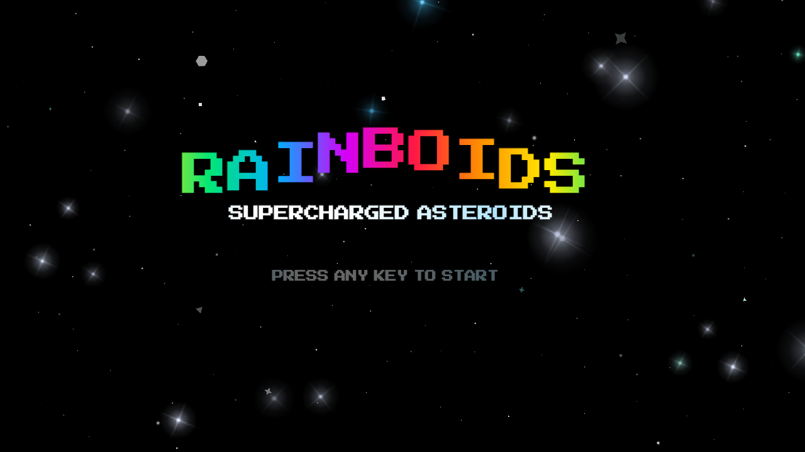
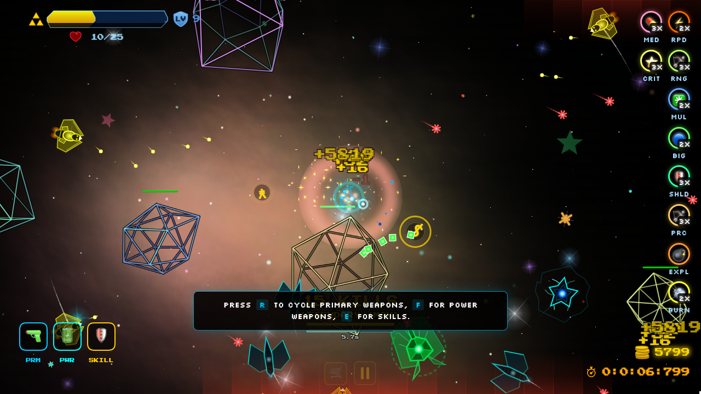
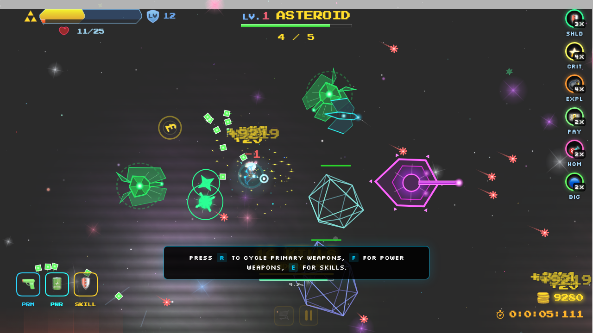
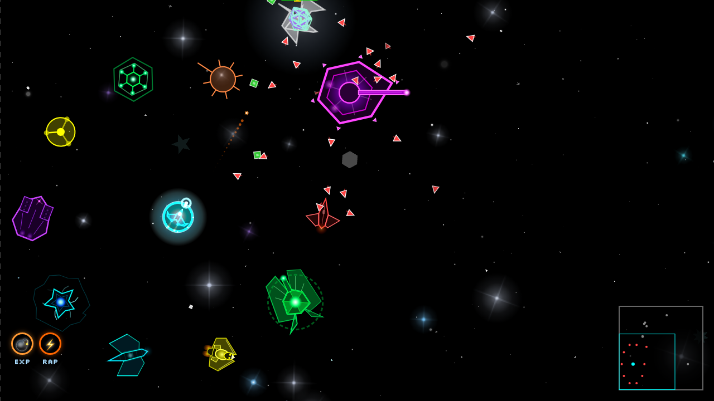

<div align="center">


### A looter-shooter that fuses twin-stick arcade combat with deep itemization.

Elements & resistances, rolled rarity-tiered gear, kill-streak power tiers, and a 30-wave boss gauntlet — all in your browser, no install.

# ▶ Play free now at [**rainboids.com**](https://rainboids.com/)

[](https://rainboids.com/)


&nbsp;
&nbsp;
&nbsp;[](LICENSE)

[Changelog](CHANGELOG.md) &nbsp;·&nbsp; [Community](#-community)

</div>

---

> **🚧 8.0.0 — Looter-Economy Pivot (in development on `master`).** Rainboids is
> mid-transition into a deeper looter-shooter: persistent **Rainshards (R$)** +
> gear / weapons / **Matrices**, **per-run** level & SP, *gear, weapons & powers
> found as loot* (abilities stay a gold sink), **bounties**, and a per-run
> **class**. The functional systems have landed (see the [8.0.0 changelog](CHANGELOG.md));
> the BUILD-screen UI polish + balance pass are still in progress and **not yet
> deployed**. The sections below describe the currently-live **7.1.0** build and
> will be rewritten when the pivot ships.

## 🎮 Controls

Open **[rainboids.com](https://rainboids.com/)** in any modern desktop or mobile browser. Plug in a gamepad and it just works.

| Action | ⌨️ Mouse + Keyboard | 🎮 Gamepad |
|---|---|---|
| Move | `WASD` | Left stick |
| Aim | Mouse cursor (or `←`/`→`) | Right stick (twin-stick) |
| Dash (i-frames) | `Shift` | `R1` / `RB` |
| Fire primary | Hold `L-click` / `↑` | `R2` |
| Fire power weapon | `Space` / `R-click` / `↓` | `L2` |
| Activate abilities (4 slots) | `1` `2` `3` `4` | `✕/A` · `◯/B` · `□/X` · `△/Y` |
| Toggle auto-aim · Lock-on (hold) | — | `L3` · `R3` |
| Inventory · Stats · Pause | `I` · `` ` `` · `Esc` | — · — · `Start` |

Your **weapons are equipped gear** — equip your **primary + power** weapons and the **5 gear slots** in the **INVENTORY overlay** (open it any time with `I`, **mid-run too**, or from the BUILD **GEAR** tab's *Open Inventory* button). Changes apply **instantly** — gear is no longer locked once a run starts. (Weapon-selection radials on `F`/`E` are a developer-only option, off unless enabled in debug mode.)

**📱 Mobile** is one-thumb play: drag the analog stick to move, tap to dash, and the Co-Pilot handles aim, primary fire, smart power use, and ability timing. Positioning and dash timing are the active verbs.

**Assists** (pause → ASSISTS): aim-snap, auto-aim, auto-fire, auto-cast abilities, laser sight. &nbsp; **Developer debug mode:** load with `?debug=1` (persists across reloads) and press `?` for a debug menu — unlock toggles, gold/XP/level/SP grants, god/instakill, jump-to-wave, and more (also `window.dbg` in the console). There are no in-game cheats.

**Fonts** (title **SETTINGS** or pause → DISPLAY): pick the menu typography — separate header/tab and body fonts from a roster of pixel faces (Press Start 2P, Silkscreen, Pixelify Sans, Fira Code) and modern ones (Inter, Roboto, Montserrat, Helvetica Neue, System UI), and **scale header/body text size** (70–160%) for readability. Retro pixel and a large, readable default; choices persist.

---

## ⚙️ How It Works

**🔫 Arsenal** — **11 primary** firing patterns delivered as **loot**: your primary is the **weapon item you have equipped** in the pre-run **GEAR** tab — not bought in a menu. Weapons drop (and can be **fabricated** for R$) with a rolled archetype, rarity tier, and **traits**, and scale with your per-run level. Each weapon item earns a **flavorful name** — a rarity **title** + base weapon + an optional **element epithet** (e.g. *Vanguard Rail Driver of Cinders*); commons read clean as **Stock <Weapon>**, so the starter is the **Stock Pulse Cannon**. Primaries fire continuously; **power weapons run on a passive-regen energy meter** (the glass sphere beside your red health orb) — it fills automatically over time, the ship visibly charges up as it fills, and a power shot fires the instant you have enough energy banked. Your **power weapon is equipped gear too** — power weapons **drop as loot** (a second found-as-gear category) and you equip one from your stash in the GEAR tab; a fresh account starts with the **Stock Charge Shot** equipped. `Phase Dash` is a free movement primitive on `Shift`.

**🧬 Weapon traits** — a weapon's **rolled traits** define how it plays: elements (Pyro spreads fire, Cryo escalates chill → freeze, Volt chains an arc, Toxic spreads corrosion, Void gathers enemies, Radiant pierces armor & shields) and behaviors (pierce, explosive, homing, stun/knockback). A weapon can carry several elements; its per-hit damage **divides across them** (focus vs coverage: one element hits hard and spikes weaknesses; many cover more and can't be hard-walled by a single resist). Traits come baked into the weapon item you find/fabricate — chase a better roll rather than tuning a fixed weapon. *(Abilities are still tuned per element on the BUILD screen's DEFENSE tab — see Abilities.)*

**✨ Abilities** — a 4-slot loadout (keys `1`–`4`) of **unique-verb** abilities: Bulwark (on-demand resist window), **Field Medic** (burst heal **+ status cleanse**), Deflector Orbs, EMP Pulse, Sentry Drone, **Blink** (teleport + i-frames), **Gravity Snare** (yank enemies inward), **Designator** (AoE MARK), **Second Wind** (cheat death once), **Elemental Infusion** (re-element your shots), **Cryo Field** (freeze zone), **Stasis Field** (slow zone), **Storm Cell** (shock zone), **Pyre Aura** (burn zone). Abilities (and Passives) **unlock as you LEVEL UP during a run**, alternating at milestone levels — an ability at L5, a passive at L7, an ability at L9, … — so the early game is a focused shooting experience (only `Shift` Phase Dash is free at the start) and your kit fills in as you push deeper. Since you level ~every 2–3 waves, a short run unlocks only the first few; the **full kit (4 abilities + 5 passives) only lands across a longer run** (everything by ~L21), and each unlock auto-equips into a free slot. Review + re-slot them any time on the pause menu's **ABILITIES** and **PASSIVES** screens — each shows the **full catalog as circle icons**, with the ones you own **lit + equippable** and the rest **grayed out** (a preview of what's still to unlock). Most abilities can also be **attuned** to a single element in the BUILD tree's DEFENSE cluster — one element each (a radio choice), landing that element's status through the ability's verb (EMP freezes/ignites caught enemies, Sentry rounds ignite/chain, Bulwark burns attackers, Blink leaves an elemental burst, …).

**🔥 Elements & resistances** — 7 elements (Kinetic · Pyro · Cryo · Volt · Toxic · Void · Radiant), each with a signature status (Burn, Corrode, Chill/Freeze, Conduct, Oil, Mark, Bleed). Enemies carry weaknesses and immunities, so bringing the right element matters — and statuses **chain into reactions**: frozen enemies SHATTER into neighbors, oiled enemies hit by fire FLARE. Elemental enemies afflict *you* back.

**💎 Loot, inventory & Cores** — 5 gear slots (cockpit/hull → HP, shielding/chassis → toughness, **nanites** → regen). Drops roll across an **8-tier rarity ladder** (Common → Rare → Exceptional → Legendary → Epic → Godlike → Divine → Transcendental) with multi-affix stats *and* per-element resist rolls. Gear is equipped in the **INVENTORY overlay** — press `I` **any time, pre-run or mid-run**, the BUILD GEAR tab's **Open Inventory** button, or the **INVENTORY button in the pause menu** (opening it pauses the game). It's a Diablo-style screen: an equipped **paper-doll** (primary weapon, power weapon, 5 gear slots), a **rarity-colored stash grid**, and a live stat sheet with compare tooltips on hover. **Tap a stash item to equip it; tap an equipped piece to unequip — changes apply instantly, even mid-run.** Drops bank to a **persistent stash** the moment you grab them (a mid-run quit or crash never loses loot), and the GEAR tab still spends **Cores** (✦) — earned by **salvaging** gear — to **reroll** an item's affixes or **tier-up** its rarity.

**🪙 Gold economy** — **flat and skill-based.** Gold is **decoupled from level, gear, and wave**: every drop rolls a fixed range × your **killstreak** multiplier (the only modifier — kill fast and don't get hit), so a wave-30 kill pays the same as a wave-1 kill and prices never feel cheap late. Enemies drop **25–55**, bosses **250–1100** by tier, asteroids occasionally chip in — roughly **3k by wave 5, ~22–32k over a full run**. There's no wave-clear gold bonus. Two wallets: **Run-gold** starts at **0** each run, accrues from kills, and **banks into account-gold** when the run ends — win, death, or abandoning early — so it's **never lost** (there are no in-run gold sinks; the old card-draft reroll/repair/extra-card/revive moment was removed with the looter pivot). **Account-gold** is the persistent wallet you spend in the **BUILD** screen on permanent **ability** unlocks (flat **10k**, **100% resellable** so you can experiment freely) — weapons and gear are found as loot, not bought.

**🧿 Passives** — build-defining **rule-modifier** relics (distinct from the numeric STATS). They all **start locked** and are **awarded during a run** (unlocked as you level up — no pre-run shopping), then equipped into a small set of slots. Slots open as you reach boss waves (scaling up in longer runs). The modular passives that stack safely (Opportunist, Catalyst, Ricochet…) live on the pause menu's **PASSIVES** screen (the full catalog as circle icons — owned ones lit, the rest grayed). The **build-defining keystones** are split out as **Keystone Traits** on their own pause-menu screen: you **pick one at level 10 and another at level 20** (a real choice from the keystone catalog), for **at most 2 keystones**. **No-downsides design:** a keystone is defined by the *build it unlocks*, not by an imposed penalty — fragility is emergent (all-offense slotting), never a tax. This anchors distinct **build archetypes**: a **crit/execute** path (Glass Cannon — +40% damage scaling to +90% as your HP falls — plus Apex Predator, which executes enemies under 15% HP); a **blood / lifesteal** path (Bloodshield banks over-heal as a damage-soaking buffer, Bloodlust ramps damage on kills, Sanguine + Hemoglutton feed sustain); and a **power-weapon energy** path (Capacitor/Reactor/Efficiency stats + Overflow Capacitor, Capacitor Bank's overcharge, and the Overclock keystone that fires powers on a flat cooldown with no meter). They're **swappable mid-run** from those pause-menu screens, and **top-tier gear can also roll a passive** (modular on Exceptional+, a keystone only on Transcendental) that's active without using a slot. *(Rolling out — the full system + a curated set of working effects are live; the rest of the catalog lands incrementally.)*

**📈 Progression** — power comes from **looted gear + rolled weapon traits**, not card picks: there is **no per-wave powerup draft and no next-stage risk/reward picker** — waves are **purely CPU-governed**, so each clear advances straight into the next with no choice moment. You **level up roughly every 2–3 waves** — each wave clear grants a chunk of XP (kills add a small bonus) — toward a **per-run level** (cap 100; level, XP and SP all **reset each run**); each level = 1 **SP** and **milestone levels unlock abilities + passives** (alternating — see Abilities), and the **STATS screen auto-opens at a boss wave** (every 10) when you've leveled, to spend banked SP on per-run stats (HP, toughness, crit, dodge, speed, regen, vampirism, thorns, and the power-weapon **energy economy** — capacitor / reactor / efficiency). Your **LEVEL and POWER (build strength) headline the STATS screen** in large shimmering numerals — both were pulled off the in-game HUD (which now shows just your health/energy orbs and a "+N SP" nudge) to keep the play area clean. A **20-tier kill-streak ladder** (EMPOWERED → … → RAINBOIDS GOD) buffs damage until you take a hit.

**🏁 Campaign** — a speedrun whose **length you choose on a single WAVES slider** in RUN SETUP — **10 to 100 waves** (default **30**); waves are **purely CPU-governed** (no stages, no next-stage picker). Difficulty is **random, not adaptive** — each wave rolls a fresh challenge off a rising baseline, so some waves are quiet and others **spike into punishing walls** you didn't see coming. Survive a hard spike and you're paid for it: a **tough wave drops markedly more (and rarer) loot**, so a brutal gauntlet is its own reward. A **boss spawns every 10 waves** — 10 unique multi-phase bosses in all, each with its own gimmick (rotating weak-points, element-gated armor plates, shield-drone reflectors, Pyro/Cryo twins, conduit-node storms, egg-sac swarms, four-element turrets, an adaptive resist wall, a projectile-devouring maw, and a 5-aspect all-element finale) — so a full 100-wave run plays the whole roster and the finale lands on wave 100. The whole run is **timed**, and the **final time** headlines the Game Complete screen alongside accuracy, damage, kills, and your preferred weapon. Because the campaign is a speedrun, a faster clear grades into a higher named completion tier — **CASUAL** (under 20 min) → STEADY → EMPOWERED → UNSTOPPABLE → LEGENDARY → **GODLIKE** (under 5 min). **Meta persists** across runs in `localStorage` — account-gold, unlocks, gear, upgrades, and level/SP carry over: `NEW GAME` opens a **two-step pre-run**: first the **BUILD** screen — a single focused **GEAR** step where you **equip your weapons and gear** (primary weapon, power weapon, and the 5 gear slots) — then `RUN SETUP →` advances to its **own screen** to pick the run length + difficulty before `START RUN` (you never have to buy anything to start a run; `← BACK` returns to BUILD). Abilities, passives, and stats are no longer chosen pre-run — they're **earned and managed in-run** (abilities + passives unlock as you level; stats spend SP on the in-run STATS screen). `CONTINUE` resumes mid-run, skipping the pre-run screens. **New accounts start lean**: an equipped **Stock Pulse Cannon** and **Stock Charge Shot** (no abilities yet), a starter gear piece, and a small Rainshard stipend — everything else is found as **loot** — and the early waves **front-load enemy variety**, debuting a distinct new threat almost every wave so the opening never feels repetitive, with the **first boss at wave 10**. The **meta account stays continuously in sync** — gold, gear, level/SP, unlocks, and powerups flush to `localStorage` within ~1s of any change (coalesced so bursts of pickups are a single write) and again on tab close; the mid-run resume bookmark autosaves every ~15s.

**🚀 Ship skins** — a cosmetic-only **HANGAR** (opened from the title screen) lets you pick from **12 ship hulls** with a live animated preview: the default spectral interceptor, the restored classic fighter, a detailed flagship, and homages to genre favorites (a forked-prow saucer, a split-S-foil strike fighter, a Yamato-charging capital ship, and more). Every hull shares the same fixed collision size, so the choice is **purely visual** and never affects gameplay.

> **20+ enemy types** with distinct movement, attacks, and elemental identities — from the orbiting **Hunter** and the freeze-shattering **Wasp** swarm to the anti-meta **Warden** that adapts its resistance to whatever element you keep using, forcing you to switch. Enemies are **aggressive**: they track you faster, fire far more often, the tanky ones grind toward you instead of drifting, and the hulking **Titan** rakes you with a **machine gun** between its sweeping lasers — which now strike with **much less warning**.

---

## 🖼️ Screenshots

<div align="center">

 
 

</div>

---

## 🛠️ Development

Vanilla **ES6 modules** rendered on **Canvas 2D** with a **WebGL2** particle layer for glow. No build step for dev — just a static server.

```bash
git clone https://github.com/afeique/rainboids.git
cd rainboids && npm install
npm run dev          # → http://localhost:8090
```

| Task | Command |
|---|---|
| Dev server | `npm run dev` |
| Unit tests (Jest) | `npm run test:unit` |
| QA smoke (Playwright) | `npm run test:qa` |
| Full E2E | `npm run test:e2e` &nbsp;(`:enemies` · `:waves` · `:survival` · …) |
| Performance / FPS | `npm run test:perf` |
| Run everything (unit→qa→e2e→perf) | `npm test` |
| AI QA bot (auto-playtester) | `npm run qa:bot` &nbsp;(`:quick` · `:long` · `:headed` · `:balance`) |
| Microbenchmarks (mitata) | `npm run bench` &nbsp;(`:pool` · `:collision` · `:wave` · `:math`) |
| Allure reports | `npm run report:allure` |
| Regenerate assets | `npm run generate-playlist` · `npm run generate-sfx` |
| Desktop app (Electron) | `npm run electron:dev` · `electron:build:mac\|win\|linux` |

> First Playwright run needs browsers: `npx playwright install`. Every Playwright run also writes `tests/report/results.json`; the `*:json` scripts emit pure JSON to stdout (pipe to `jq`).

<details>
<summary><b>Project structure</b></summary>

```
index.html              # Solo game entry point
mp.html                 # Multiplayer (co-op) entry point — experimental
VERSION · CHANGELOG.md  # Solo semantic version + history
VERSION-MP · CHANGELOG-MP.md  # Multiplayer semantic version + history
CLAUDE.md               # Contributor / agent instructions
js/
  main.js               # Bootstrap
  modules/
    game-engine.js      # Game loop orchestrator
    core/               # constants, state machine, pools, event bus, timers, storage, debug-config
    platform/           # device + viewport detection
    player/             # entity, weapons, abilities, progression, lifecycle, renderer, skins/
    assist/             # Co-Pilot sense/decide/act helpers for mobile and opt-in assists
    enemy/              # entity, data, movement, firing, AI, shapes, boss phases/parts/intro/rage/fx/render, bosses/ (10 unique)
    combat/             # elements, collision, weapon-data, combat-manager
    hud/ · world/ · shop/ · ui/ · wave/ · audio/ · performance/ · render/
  sim/                  # shared headless co-op sim (pure JS; runs in Node + browser)
  mp/                   # multiplayer client — net/ (transport+codec) · netcode/ (predict/interp) · renderer
css/                    # styles.css
sfx/                    # 47 pre-rendered SFXR WAVs (regen: npm run generate-sfx)
music/                  # background tracks
tests/                  # unit/ (Jest) · qa/ e2e/ performance/ (Playwright) · helpers/
tools/                  # benchmark/ · ai-qa-bot/ · scripts/
server/                 # Node.js authoritative multiplayer server (imports js/sim) — see server/README.md
screenshots/ · electron/ · docs/
multiplayer/            # earlier Rust/WASM co-op attempt — SHELVED (see multiplayer/RESTORE.md)
```

> **Multiplayer (experimental):** authoritative Node.js server that, by default,
> runs the **actual single-player simulation headless** (`server/src/sim/sp-host.js`,
> Path A) — co-op with the real SP weapons/enemies/collisions/waves and
> downed+revive, graphically identical to single-player. (The original lightweight
> `js/sim/` toy sim is still selectable via `MP_SIM=toy`.) Run `npm run mp:install`
> once, then `npm run mp:server`, serve the client with `npm run dev`, and open
> `/mp.html` (`?room=CODE` for a private game). Details in `server/README.md`.
</details>

---

## 💬 Community

<div align="center">

<a href="https://discord.gg/PRKpC4HCcc"></a>

**[Jump into the Rainboids Discord](https://discord.gg/PRKpC4HCcc)** — share builds, report bugs, and chase the leaderboard.

</div>

---

## 🎵 Credits & License

- **Music** — most tracks are original compositions by **afeique** (licensed **[CC BY-NC 4.0](https://creativecommons.org/licenses/by-nc/4.0/)**); 10 royalty-free tracks are **"Music by Karl Casey @ White Bat Audio"** ([whitebataudio.com](https://whitebataudio.com/) · [YouTube](https://www.youtube.com/@WhiteBatAudio)), used under [his license](https://whitebataudio.com/license-agreement/): *Aura · Beyond the Shadows · Dangerous · Inferno · Iridium · Legend · Midnight · Out for Blood · Salvation · World Eater*.
- **SFX** — every sound is SFXR-generated (no third-party sample packs).
- **Key-hint sprites** — "[SimpleKeys](https://beamedeighth.itch.io/simplekeys-animated-pixel-keyboard-keys)" by **beamedeighth**, used under its free-use license.
- Builds on the original **[Monolithic Rainboids](https://github.com/afeique/rainboids-monolithic)** with extensive modularization.
- **License** — source code is **source-available under the [PolyForm Noncommercial License 1.0.0](LICENSE)**: free to use, study, modify, and share for *noncommercial* purposes; commercial use requires a separate license. Original **music is [CC BY-NC 4.0](https://creativecommons.org/licenses/by-nc/4.0/)**; artwork and the "Rainboids" name are reserved. Full details in **[NOTICE](NOTICE)**.

<div align="center"><sub>made with 🌈 by <a href="https://github.com/afeique">@afeique</a></sub></div>
