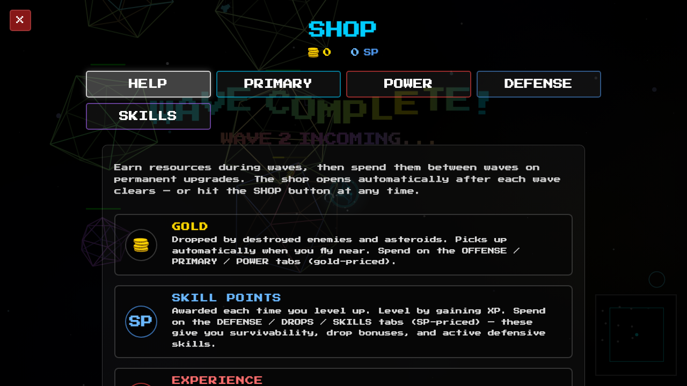
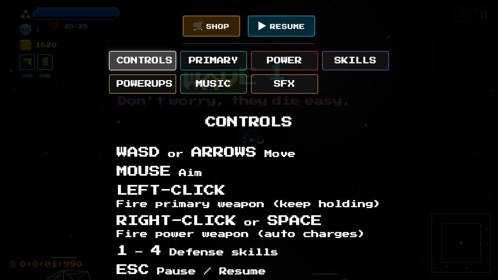
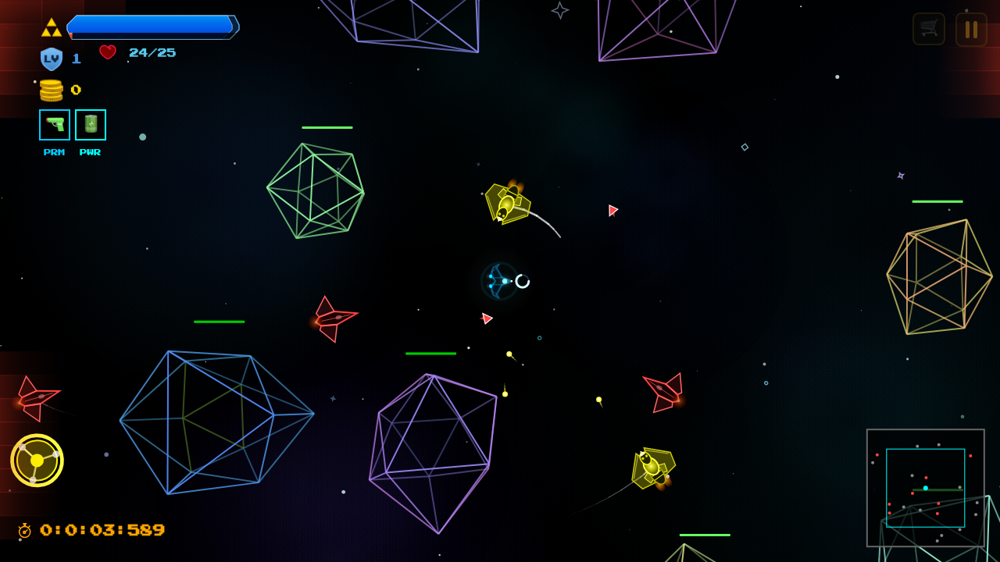
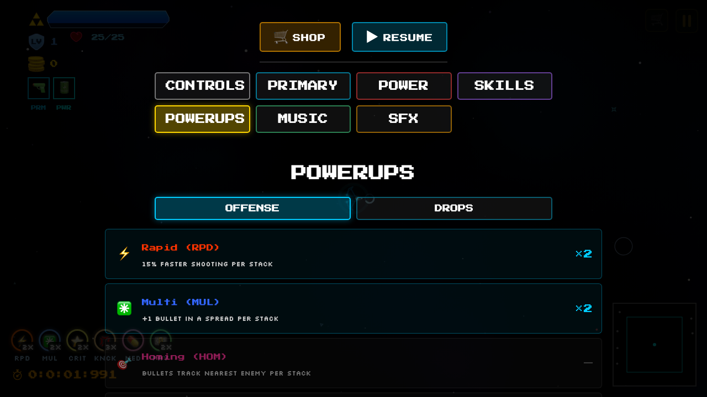
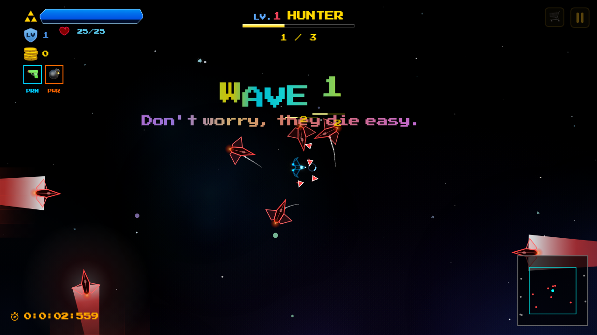
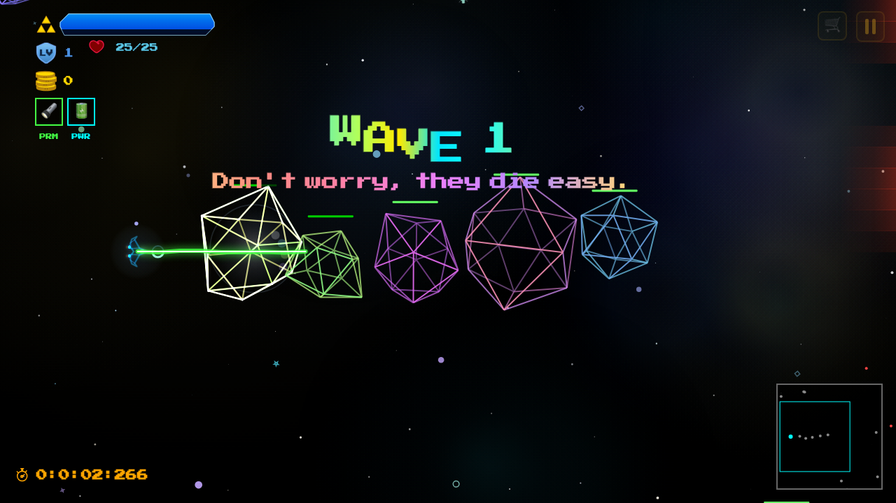
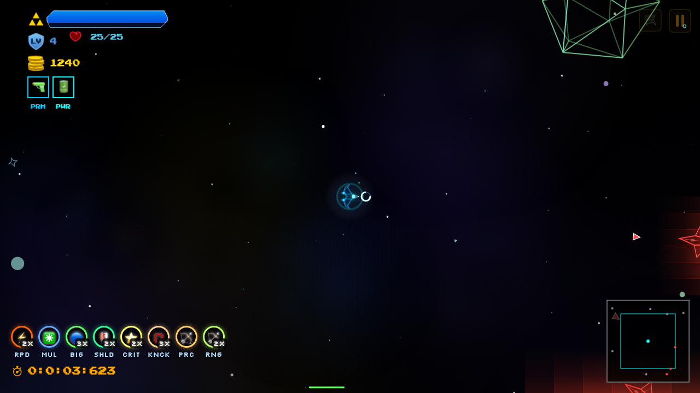
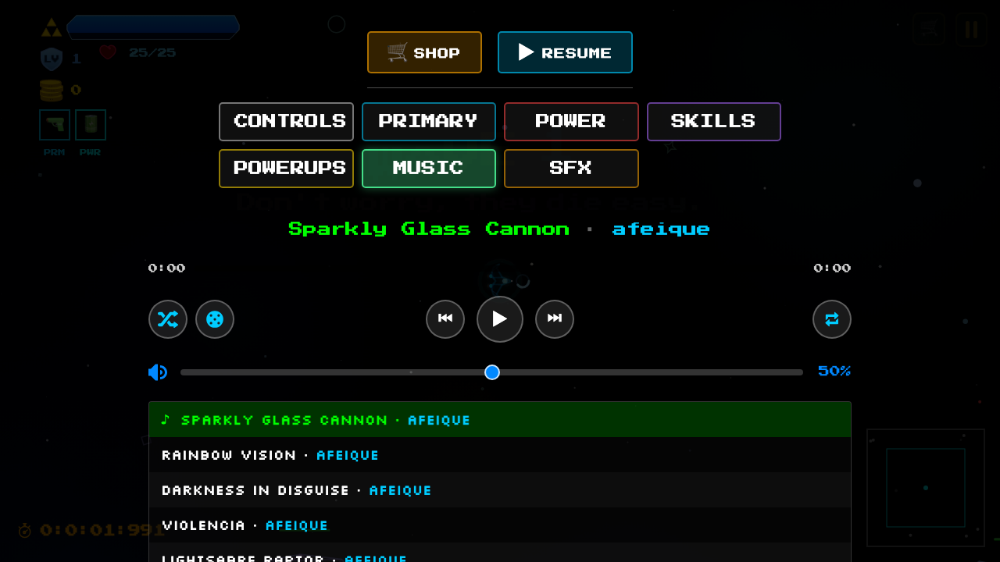
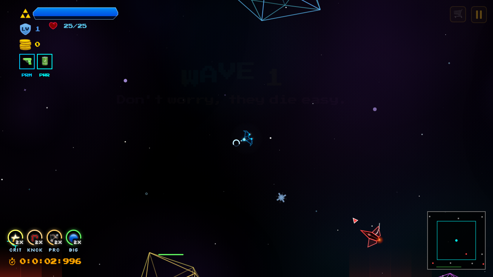
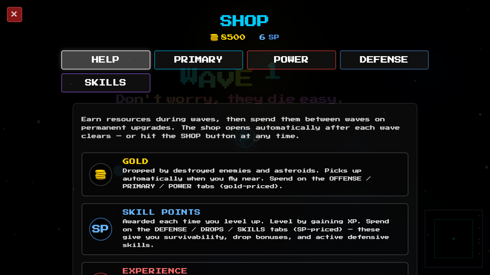

The word "fun" is subjective. Everyone has a different notion of fun, and what appeals to one person may not be as engaging for the next. Nevertheless, there is a common denominator that appeals to a broader subset of people, and there have always been craftspeople who intuit what is fun on this grander scope: artists who have crafted games for the masses.

Owing in part to the sheer number of people with varied preferences and in part to the sheer level of innovation in the games industry, there are many different kinds of games. The overarching commonality of all these forms of entertainment is that they bridge innate human psychologies with action. Humans have evolved to find an innate sense of reward from exploration, finding rewards, and overcoming enemies and obstacles. We are naturally drawn to bright, shiny things and vibrant colors. Our need for individual self-expression leads us to want to create virtual heroes and characters that reflect ourselves on some level, and reinforce our intuitive connection to our in-game avatars.

Starting Point

I started Rainboids (as one often does) based on a preexisting archetype and model, in this case, the seminal 1980s hit, "Asteroids." The initial goal was simply to make a modernized Asteroids experience for the browser and mobile. "Modernized" in this context referred to having more intricate 3d wireframe graphics and a slew of pickups to provide a fresh twist on an age-old concept; a shiny wrapper over a time-proven core.

The initial prototype was developed as a single, monolithic JavaScript file. It was developed using Gemini 2.5, and play-tested within the Gemini browser environment. Gemini was able to one-shot a monolithic Asteroids game based on the the 1980s original, which became the cornerstone of refinement.

The first goal was to make everything shinier. I envisioned colorful, 3d asteroids with shaded faces and wanted to test the pseudo-3d rendering capabilities of 2d HTML Canvas.

I quickly encountered limitations that informed development – for example, shaded 3d faces did not look very good and fettered performance considerably because they involved drawing filled geometry. 3d wireframes, in contrast, looked beautiful and were quite efficient to get up and running using 2d primitive draw calls.

Graphical Focus and Optimization

A big part of modern games is providing a satisfying graphical component to draw the player in and provide immersion. It's safe to say that the graphical and sonic feedback of many games drives their satisfying nature. Bearing that in mind, a commensurate amount of time was thus given purely to graphical refinement and optimization. Over the course of development, tremendous effort has been given not only to have vibrant, attractive visuals and visual effects, but also to make these effects performant and able to support large amounts of on-screen geometry.

One of the key methods to getting vibrant colors onscreen was the use of CSS-based shadow blur. Working with HTML Canvas has the benefit that we can utilize CSS graphical effects, which makes up for a lack of access to a native rendering API. On the flip-side, browser-implemented effects are not nearly as efficient or performant as what you'd expect from a native graphical API.

The initial version of Rainboids looked great, but suffered from tremendous performance degradation with even a few asteroids on-screen. This was the result of numerous inefficiencies in the draw stack, including unbatched draw calls and excessive use of shadow blur.

We eventually optimized around these limitations using a variety of techniques, including: sprite-batching, emulating shadow blur using gradients, temporal upscaling of game logic, and batched draw calls. For references, there's another in-depth article on all these optimizations.

After making these optimizations, I felt much freer to add features I thought would be fun and improve the gameplay.

Boring Upgrades

Upgrades should be exciting, right?

To a certain extent, they were. But not as originally implemented. What happened in development was this:

Initially: stackable, temporary powerups that drop from enemies.

Then a shop system with permanent upgrades.

Problem: the shop system is behind the pause menu which means a pause in the action.

Buying upgrades felt like a chore. During my play-testing, I practically never did it.

Despite this, I did continue putting a lot of time into upgrades. The reason was, I was confident that I could rewire the pieces later into something more fun. You know, sometimes you just need more lego-pieces to build with, and I understood that was the stage I was at.

First, there were upgrades for the user's primary weapon. This included upgrades to critical percent, critical damage, and so on.

Then there was the addition of different purchasable weapons. Weapons like the Storm Needle, Lightning Arc, etc.

Then there were distinct upgrades for each weapon. Upgrades specific to each unique weapon. This was to encourage the user to focus on a specific build for each play-session.

Most of these upgrades were added willy-nilly – "boy, wouldn't this be fun!" and "I'm sure people would enjoy this!"

And yes, these WERE fun weapons. The problem was, there was never enough incentive for the player to go hunting through the pause menu and try different things. Even if the player tried different weapons, there wasn't incentive to upgrade them.

Moreover, there were a lot of boring upgrades to distract the player's attention from the fun stuff. Like, critical percent chance? Yeah, that sounds nice on paper – but in terms of visceral feedback in the game? Not so much.

It's important now to remember, different strokes for different folks: there probably is someone out there who would be positively tickled by having a +40% crit rate, even if the difference is barely discernible looking at the raw DPS digits being dropped in-game.

Streamlining Weapons

The first step in all of this was to make all weapons accessible from the get-go. Rather than gating weapons with some weapons being more powerful than others, the idea was to design the game so the player would choose a particular weapon, and then upgrade and build it out. That way, the player could quickly replay the game trying out different weapons with different upgrade-tracks which would lead to varied gameplay sessions and experiences.

Ultimately, that means more work balancing the gameplay mechanics and playtesting, but overall, it means there are many ways to play a game, which increases replayability and ideally keeps players coming back for more.

Once weapon selection was free, the natural follow-up was: how fast can the player change their mind? Burying weapon switching behind the pause menu defeated the whole goal — I wanted experimentation to feel cheap, almost casual. The answer was a one-key cycle: Tab rotates through every primary weapon, R cycles power weapons, and the newly-equipped weapon auto-adds itself to the player's owned set so the rest of the game (shop upgrades, sell paths, HUD) treats it as theirs. Two small HUD squares — PRM and PWR — now sit beneath the gold display showing the equipped pair, with a quick scale-pulse + colored glow whenever the player taps Tab/R. The animation is the whole point. Without it, the player presses a key and nothing visibly changes — they wonder if it worked, and the binding starts to feel broken. With it, every keypress feels like flipping a switch on a control panel: tactile, immediate, real.

I also realized cycling has to work even when there's only one weapon owned of a given type. Pressing Tab on a fresh save and getting silence is the same problem as the broken-feeling shuffle button I'd been wrestling with on the music player — keyboard input that fires the visual feedback without changing state still teaches the player the binding works. Patient, consistent feedback is half the battle.

The Bullet-Hell Turn

Even with weapons sorted, the early game was sleepy. Wave 1 was a single hunter and two asteroids — by the time the player understood the controls, they were already three waves in and bored. So I tore the early-wave numbers apart. 

Wave 1 became 6 asteroids and 3 hunters. 

Wave 2: 8 asteroids, 4 hunters. 

Asteroid health was halved, smalls became one-shot, enemy HP cut another 30-40%, and reward points bumped 60% across the board. XP per hit doubled. Per-level scaling steepened — enemy levels climb every 3 waves now instead of every 5.

The result was that the first 60 seconds of a fresh run feel like a swarm. Bullets, debris, and asteroid fragments fill the screen. The player's first level-up arrives during wave 1, the first significant gold pile arrives by wave 2, and there's a real reason to crack open the shop by wave 3. The pacing now has gravity: things are happening, the player is making decisions, and time is running out before the next wave's threat materializes.

Asteroid concurrency caps had to come up to support the density — MAX_ASTEROIDS jumped from 4 to 16 — but I made sure the rendering held up by leaning on the prior optimization work. The 3D wireframes are cheap, and the particle pool's hard cap of 50 keeps the kill-burst storms tasteful. I ran the microbenchmark suite to confirm nothing fell off a cliff. (And along the way fixed stale import paths in the bench scripts that had been broken for months. Yet another small dragon.)

Powerups Became Permanent

The biggest design change was the most counterintuitive. Powerups had always been temporary buffs — pick up a Big Bullets, get +30% bullet size for 30 seconds. Picking one up was a tiny dopamine ping, but it expired with no narrative weight. The shop sold permanent versions, but the shop felt like homework.

I flipped the model. Now every powerup that drops is permanent and stacking. They're rarer to drop (rarities cut in half across the board), but every pickup is a forever upgrade. Big Bullets stacks. Pierce stacks. Crit chance stacks. The powerup HUD at the bottom of the screen becomes a slowly-growing trophy rack of the run's identity.

Because the game now has a real powerup collection, the OFFENSE and DROPS shop tabs went away entirely. That was 25+ rows of upgrades that the player no longer had to scroll through. The shop became sharper: just weapons, defensive survivability, and active skills. The powerups screen, accessible from the pause menu like the music player tab, displays every powerup type in two sub-tabs (OFFENSE and DROPS) with stack counts and color-coded names — owned ones glow, unowned ones sit dim. It reads as a Pokédex: here's what you've found, here's what's still out there.

This sounds like a wash — fewer shop items but more random drops — but the gameplay feel is night and day. Buying upgrades was opt-in friction. Picking up a glowing thing on the battlefield is reward. The same +30% bullet size means very different things depending on how the player got it.

Juicing the Weight

A common piece of game-feel advice is "juice it or lose it" — every action should produce satisfying feedback. I'd been adding visuals throughout development, but a couple of weapons were embarrassingly broken-feeling. They simply lacked any real "punch" even if they did damage and destroyed things.

Then came the knockback trait. I added a new global powerup, KNOCKBACK, that scales the impulse all four power weapons impart on enemies and asteroids. Every Mine, Nova ring, Lightning hop, and Missile impact applies a position-derived velocity push. Asteroids fly outward from explosions. Enemies get yanked along the bolt of a Lightning Arc. 

A weapon that saw a lot of change were the mines, a power weapon that was intended to evoke a sense of destruction by allowing the player to set a minefield to ensnare enemies. Unfortunately, the initial design had a high cooldown and not enough "juice" on the mines. They were initially very static, boring mines that just sat there – completely unsatisfying. 

A major problem with the mines were the odds of an enemy or asteroid colliding with one were fairly slim. The fix? Turning them into Seeker Mines which actively move around, seeking targets and magnetically pull-in nearby targets. 

Watching a mine creep toward a wandering Hunter and detonate against the asteroid cluster behind it produces the kind of cascade that's hard to plan and easy to enjoy.

The Lance Beam got the same treatment. It used to pop on at full strength, dump damage for 0.4 seconds, and disappear — a strobe more than a beam. After the bullet-hell pass made everything denser, that flicker felt incidental. So I rebuilt it as a sustained low-DPS commitment: 5× longer duration (2 seconds), per-frame damage halved, and a 150ms ease-out grow-in on both width and reach so the strike has weight. The beam line itself is now broken into 6+ jagged zig-zag segments with perpendicular jitter — the sustained sister of the Lightning Arc visual. Asteroids finally take damage from it (the original collision check only looked at enemies — another silent bug) and get a gentle forward push for the duration of contact.

Communicating at a Glance

As the powerup count grew, the bottom-of-screen HUD started running out of horizontal space. Each badge was showing the full powerup name in caps — RAPID FIRE, MULTI SHOT, AFTERBURNER — which meant six or seven powerups was already pushing into the right edge. The fix was three-letter (sometimes four) abbreviations: RPD, MUL, BURN, PRC, EXPL, CRIT, CDMG, SHLD, KNCK, RNG, MED, DOC, PAY, HRL, HLK, GLK, HBT, GBT.

The risk with abbreviation is that the player has to learn them, which is friction. I attempted to solve that with hover tooltips: hovering over a HUD powerup badge pops a small Silkscreen-font popup with the full name and effect description, zero-delay (CSS :hover::after, no native title lag). The Powerups menu in the pause screen also displays each powerup as "Pierce (PRC)" so the codes are taught in context. The tooltip pattern reuses what I built earlier for the music-player buttons — Shuffle, Random, Repeat all show their function on hover instead of forcing the player to guess emoji.

This is one of those changes that doesn't move any gameplay numbers but makes everything feel more polished. The player never has to wonder what a thing does, ever, anywhere on the screen. That confidence compounds.

The Shop, Reduced

After moving offensive and drop upgrades to the powerup-pickup system, the shop is now four tabs: HELP, PRIMARY (per-weapon upgrade tree for whatever's currently equipped), POWER (same, for power weapons), DEFENSE (HP, shielding, speed, triage cooldowns, spare ship), and SKILLS. That's it. The shop opens automatically between waves; it can also be opened mid-run via the HUD button or the pause menu. Closing it routes back to wherever it was opened from — pause menu returns to pause, mid-run returns to mid-run, between-wave starts the next wave.

Tying the close-route to the open-route was a small fix that made the shop feel correct. Before, every shop close went to the pause menu, which was disorienting if you'd opened the shop from gameplay. Tracking the entry state and dispatching to the appropriate close path took maybe twenty lines, but the felt difference is large — the shop is no longer a portal that always dumps you somewhere unexpected.

Lessons

A few patterns I'd reach for again if I started another project tomorrow:

Build the lego-pieces, then assemble. A lot of work that initially felt unrewarding — the boring crit-chance upgrades, the multi-weapon system, the original temporary-powerup mechanic — turned out to be raw material I could later remix into something exciting. The decision to make all weapons free, to make all powerups permanent, to remove offense/drops from the shop — none of those would have been possible without a glut of content to rearrange.

The fix is usually re-routing, not rewriting. Most of the major design changes in this project were connective — Tab to cycle, R to cycle, knockback as a global multiplier, the same ESC handler routing the shop close based on origin. The pieces were already there. What changed was how they talked to each other.

Juice everything you ship. Not just damage numbers — every input. Tab pulses the HUD. Music buttons flash on click. Mines blink, then strobe, then explode in a burst of debris. Every one of those lines of code was tiny; the felt impact of all of them together is the difference between "another browser game" and a thing the player wants to start again.

Communicate constantly. Three-letter abbreviations beat full names for HUD density, but only if the player can hover for a description. Each powerup pickup now shows its name and its effect on screen for a few seconds. Wave 1 fires onboarding hints about Tab and R. The seeker mine's last 2 seconds turn red and strobe. The sustained Lance Beam grows in instead of popping on. None of these are mechanics. They're legibility. And legibility is a load-bearing wall in fun.

What's next is more of the same: more weapons, more wave variety, more silly powerup combinations to discover. But the core insight that's stuck with me through this is that fun isn't an additive property of features — it's a multiplicative property of how those features connect, communicate, and reward the player for paying attention. Stack the lego-pieces high, then knock them down in interesting ways. The rest is iteration.